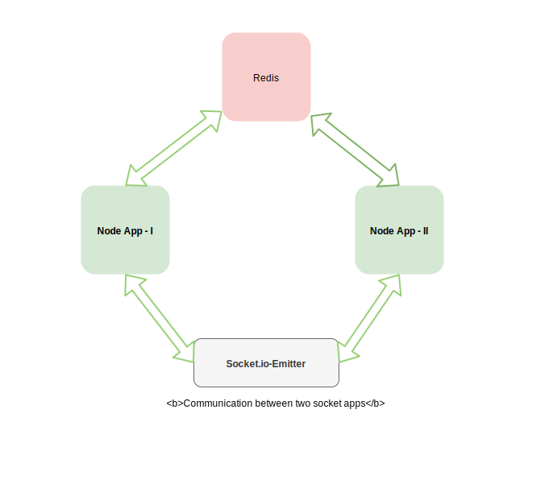

# Socet.io-Emitter Example
This is simple application which demonstrate how two separate socket application can talk to each other.

# Why RedisStore
Any message that you emit in a worker will only be sent to a clients connected to a same worker, since there is no IPC (Inter Process Communication) between the workers.

Using the RedisStore, your messages will be published to a redis server, which all your workers are subscribing to. Thus, the message will be picked up and broadcast by all workers, and all connected clients.

# Installation
1. Go to front-end folder and run `npm install`
2. Go to back-end folder and run `npm install`
3. Run npm run dev in both the folders
4. Go to `http://localhost:6001`

# Working
There are two folder in this project i.e front-end and back-end.

### Front-end
- Front-end folder contain one application code i.e. server is configured with socket and redis
- It also serve html file to display the output of other application

### Back-end
- Back-end folder serve other application.
- It emits current time every second

For cluster refer - https://stackoverflow.com/questions/18310635/scaling-socket-io-to-multiple-node-js-processes-using-cluster